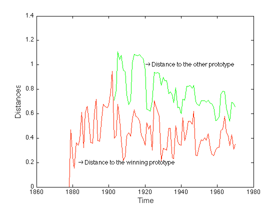

--- 
title       : Events in turbulence time series
subtitle    : Presubmission review seminar 
author      : Yanfei Kang 
job         : Supervised by Prof. Kate Smith-Miles and Dr. Danijel Belusic
framework   : io2012   # {io2012, html5slides, shower, dzslides, ...}
highlighter : highlight.js  # {highlight.js, prettify, highlight}
hitheme     : tomorrow      # 
widgets     : mathjax
mode        : selfcontained # {standalone, draft, selfcontained}
transition  : fade

--- bg:#f5f5ae

```{r preload, echo=FALSE,message=FALSE,comment=FALSE,tidy=TRUE,results='hide'}
setwd('~/Documents/Meetings_2012/Rfunctions')
file.sources = list.files(pattern="*.R")
sapply(file.sources,source)
```

## Introduction

### - Motivation

### - Difficulties

### - Objectives 

---
## Motivation

``` {r chunk0,fig.align='center',cache=TRUE,message=FALSE,echo=FALSE,fig.height=4,fig.width=10,dev='pdf'}
load("~/Documents/Conferences&Presentations/Mid-review/review.Rdata")
plot(c(78700:79050),CASES99T7[78700:79050]+273,type='l',ylab="Temperature (K)",cex.lab=1.3,cex.axis=1.3,xlab='Time (s)')
lines(c(78900:b[97]),CASES99T7[78900:b[97]]+273,col="#ff53a9")
```

- Event <u>detection</u>, <u>classification</u> and <u>interpretation</u> in  turbulence time series.

  - Location?
  - Similar?
  - Physical mechanisms?

--- 

## Difficulties

- Red noise
- Varibility of spatial and temporal scales.
- Previously unknown.
- Small amount of literature.


--- 

## Objectives 

>1. Develop a method to detect and classify events:
  - does not require any pre-assumptions of events.
  - deal with high noise.
  - not limited by  stability or scales. 
>2. Application of the method on a well-known dataset
  - also a validation of the method.
>3. Use the method to
  - detect events in the unknown stable atmospheric boundary layer (ABL).
  - find  physical  dynamics of different types of events.
  - study the effects of the event to the turbulence flows.  
>4. Develop a statistical tool and make it easy to use for others.

---

## The journey 

<div align="center">

</div>

--- bg:#f5f5ae 

## Chapter 2

```{r results='asis',warning=FALSE,message=FALSE,echo=FALSE}
bib <- read.bib("copy.bib")
print(bib[1],'html')
```


--- &twocol
## An example

*** =left
<div>

</div>

*** =right
<div>

</div>

--- bg:#f5f5ae
## Chapter 3

```{r results='asis',warning=FALSE,message=FALSE,echo=FALSE}
print(bib[3],'html')
```

--- bg:#f5f5ae
## Chapter 3

```{r results='asis',warning=FALSE,message=FALSE,echo=FALSE}
print(bib[3],'html')
```

## What are events? Characteristics?

### Coherent structures

- A typical type of events

- Generally used assumption: phase correlation

- Really? Can we use that to detect events?

---
## Not really! Why?

- Coherent structures detected using wavelets method
- Measure their phase correlation.
- How? Using surrogates.

---
## Surrogates of $x_O(t)$


>1. phase randomized surrogate $x_R(t)$
  - take the Fourier Transform of $x_O(t)$.
  - randomize phase information while keeping the magnitude.
  - do inverse Fourier Transform to get back to time domain to get $x_R(t)$.
  - none phase correlation.

>2. completely coherent surrogate $x_C(t)$
  - obtained by making the phases constant.
  - largest phase correlation

---
## Measure of phase correlation I
### Coherece index ($CI$)

Given $x_O(t)$, $x_R(t)$ and $x_C(t)$,

$$CI(q,\tau)=\left(\frac{|S_O(q,\tau)-S_R(q,\tau)|}{|S_O(q,\tau-S_R(q,\tau))|+|S_O(q,\tau)-S_C(q,\tau)|}\right)^{1/q},$$
where $S_i(q,\tau)$ is the $q$th order structure function: $S_i(q,\tau)=\left<|x_i(t+\tau)-x_i(t)|^q\right>$, $i \in \{O, R, C\}$ and $\tau$ is the time lag.


---
## Measure of phase correlation II

### Nonlinearity Measure Based on Nonlinear Prediction Error ($nm_{npe}$)
\[
X=
  \begin{bmatrix}
    x(1) & x(2) & \cdots & x(m) \\
    x(2) & x(3) & \cdots & x(m+1) \\
    \cdots & \cdots & \cdots & \cdots \\
    x(n-m+1) & x(n-m+2) & \cdots & x(n) \\
  \end{bmatrix}
\] 

For each row (delay vector) of $X$, its $k$ nearest $m$-dimensional delay vectors are found using Euclidean distances. If the $k$ nearest delay vectors for  $\vec{x}_i$ are $\vec{x}_{j_p}$, $p=1, 2, \cdots, k$, the nonlinear prediction error for the time series $x(t)$ is defined as 
$$
\tau_X(m, k)= \sum\limits_{i=1}^{n-m}\left(x(i+m) - \frac{1}{k}\sum\limits_{p=1}^k x(j_p+m)\right)^2.
$$

---
## Measure of phase correlation II

### Nonlinearity Measure Based on Nonlinear Prediction Error ($nm_{npe}$)

$$
nm_{npe}=\frac{\bar{\tau}_R-\tau_X}{3\sigma_{R}},
$$
where $\tau_X$ is the nonlinear prediction error of the original data, while $\bar{\tau}_R$ and $\sigma_R$ are the mean and standard deviation of the nonlinear prediction errors of the surrogates. 

$$
\begin{aligned}
& \\
&x(t) \text{ is } \begin{cases}
  \text{phase-correlated,} & \text{if } nm_{npe} \geq 1, \\
  \text{phase-uncorrelated,} & \text{otherwise}.
\end{cases}
\end{aligned}
$$


---
## Results
<div align="center">

</div>

---
## Conclusion


>- the space and time organized structures in turbulent flow do not necessarily have correlated phases.

>- quantitative way of event description difficult.

>- then?


--- bg:#f5f5ae

## Chapter 4

```{r results='asis',warning=FALSE,message=FALSE,echo=FALSE}
print(bib[2],'html')
```

--- bg:#f5f5ae

## Chapter 4

```{r results='asis',warning=FALSE,message=FALSE,echo=FALSE}
print(bib[2],'html')
```

## Focus shifted

<div align='center'>

<div>

---
## Artificial time series


  
``` {r chunk1,cache=TRUE,message=FALSE,echo=FALSE,fig.height=3,fig.width=12,fig.align='center',dev='pdf'}
source("~/Google Drive/Meetings/20126789/June_7/cbfs.R")
set.seed(123)
par(mfrow=c(1,4))
plot(cbf('c'),type='l',xlab='',ylab='Box',cex.lab=1.3,cex.axis=1.3)
plot(cbf('b'),type='l',xlab='',ylab='Ramp-cliff',cex.lab=1.3,cex.axis=1.3)
plot(cbf('f'),type='l',xlab='',ylab='Cliff-ramp',cex.lab=1.3,cex.axis=1.3)
plot(cbf('s'),type='l',xlab='',ylab='Sine',cex.lab=1.3,cex.axis=1.3)
```


``` {r chunk2,cache=TRUE,message=FALSE,echo=FALSE,fig.height=3.5,fig.width=12,fig.align='center',dev='pdf'}
load('~/Documents/Conferences&Presentations/SSCI_2013_paper/SSCI2013.Rdata')
library(ggplot2)
plot(c(1:length(SSCIts)),SSCIts,main='',ylab='x(t)',type='l',xlab='t')
```


---

## Methodology: two steps


1. Detect events.

2. Cluster the detected events.


---

## $1$st step: event detection 

- Perform  noise test on each subsequence.


  >- Why? Only care the non-noise subsequences.

  >- Then given a window length,  for the $q$th subsequence, get $p$-value $p_q$. For $x(t)$,  a $p$-value series:  $p_1,p_2,\cdots,p_{m-w+1}$.

--- 

## $p$-value series for the artificial data
<center>
#### Sliding window length: $w=128$
</center>
``` {r chunk4,cache=TRUE,message=FALSE,echo=FALSE,fig.height=7,fig.width=12,fig.align='center',dev='pdf'}
w=128
par(mfrow=c(2,1))
plot(c(1:length(SSCIts)),SSCIts,main='',ylab='x(t)',type='l',xlab='t',xlim=c(0,length(SSCIts)))
plot(tests,type='l',ylim=c(0,1),xlab="t",ylab="p.value",cex.lab=1.3,cex.axis=1.3,xlim=c(0,length(SSCIts)))
abline(h=c(0.05),lty=2,col=2)
```

---
## How to define events?

``` {r chunk4_1,cache=TRUE,message=FALSE,echo=FALSE,fig.height=3.5,fig.width=12,fig.align='center',dev='pdf'}
w=128
plot(tests,type='l',ylim=c(0,1),xlab="",ylab="p.value",cex.lab=1.3,cex.axis=1.3)
abline(h=c(0.05),lty=2,col=2)
```

- <span style=" border: 1px solid red;">*A potential event*</span> is a subsequence whose noise test $p$ value is smaller than a predefined significant level $\alpha$ ($\alpha=0.05$).

- Assume there exists a consecutive sequence of $p$ values $p_s,p_{s+1},\cdots,p_t$ which satisfies: 

  - $p_i\leq \alpha, i=s, s+1, \cdots, t$
  - $t-s\geq w/2$ 

    then we define the subsequence $x_{\left\lfloor\frac{t+s}{2}\right\rfloor}(t)$ as <span style=" border: 1px solid red;">*the event*</span> we are interested in.

--- 

## Showing how it works

<div align="center">

</div>

---

## Events extracted


``` {r chunk8,cache=TRUE,message=FALSE,echo=FALSE,fig.height=8,fig.width=10,fig.align='center',dev='pdf'}
load('~/Documents/Conferences&Presentations/SSCI_2013_paper/SSCI2013.Rdata')
par(mfrow=c(4,5))
for (i in 1:20)
plot(shapes_found[i,],type='l',col="#ff53a9",ylab="",xlab="",cex.lab=1.3,cex.axis=1.3)
```

---

## Robust to noise?


``` {r chunk9,cache=TRUE,message=FALSE,echo=FALSE,fig.height=6,fig.width=14,fig.align='center',dev='pdf'}
par(mfrow=c(2,2))
plot(SSCIts20,type='l',xlab='',cex.lab=1.3,cex.axis=1.3,ylab=expression(paste('Noise level: ',2*sigma)))
plot(SSCIts30,type='l',xlab='',cex.lab=1.3,cex.axis=1.3,ylab=expression(paste('Noise level: ',3*sigma)))
plot(tests20,type='l',ylim=c(0,1),xlab="",ylab="p.value",cex.lab=1.3,cex.axis=1.3)
abline(h=c(0.05),lty=2,col=2)
plot(tests30,type='l',ylim=c(0,1),xlab="",ylab="p.value",cex.lab=1.3,cex.axis=1.3)
abline(h=c(0.05),lty=2,col=2)
```


--- 

## 2nd step: event classification

#### Goal: cluster the extracted events into patterns. 


<div align="center">

</div>

--- &twocol w1:50% w2:50%

## Comparison with literature 

*** =left

<div align='center'>

</div>

*** =right 

<div align='center'>

</div>


--- bg:#f5f5ae

## Chapter 5

```{r results='asis',warning=FALSE,message=FALSE,echo=FALSE}
print(bib[4],'html')
```

--- bg:#f5f5ae

## Chapter 5

```{r results='asis',warning=FALSE,message=FALSE,echo=FALSE}
print(bib[4],'html')
```

## What's done?

- Method improvement
- Application to a well known dataset
- Validation of the method

---
## Motivation

- Pratical problems: 
  - non-stationarity
  - turbulence intermittency
- AR(1) modelling --- stationarity
- Phillips-Perron (PP) Unit Root Test (`r citet(bib[['perron1988trends']])`)

---
## Three cases of the unit root test 

- No trend, no drift:

$$X_t=\phi*X_{t-1}+u_t \: (H_0: \phi=1)$$

- No trend, drift 

$$X_t=\delta+\phi*X_{t-1}+u_t \: (H_0: \phi=1)$$

- Trend, drift 

$$X_t=\delta+a+b*t+\phi*X_{t-1}+u_t \: (H_0: \phi=1)$$

---

## PP Unit Root Test 


$$\triangle X_t=\beta' D_t+\pi*X_{t-1}+u_t,$$


$$ H_0: \pi = 0 \text{ (unit root)}$$ 
$$ H_1: \pi < 0 \text{ (stationary)}$$


- Drift and deterministic trend are considered in $D_t$.
- $X_t = \phi*X_{t-1}+u_t$.
- $\pi=0$ means  $\phi=1$ (unit root).


---

## Why PP?

- `adf.test` (test for unit root) 
- `kpss.test` (test for stationarity)
```{r whypp, echo=FALSE,fig.align='center',fig.width=6,fig.height=6,cache=TRUE,dev='pdf'}
library(doMC)
library(foreach)
registerDoMC(cores=8)
set.seed(123)
phis=seq(0.6,1,by=0.025)
n=100
ppp=foreach(k=1:length(phis),.combine=c)%dopar%{
  pp=rep(0,1000)
  for (j in 1:1000){
phi=phis[k]
x0=rnorm(1)
x=rep(NA,n)
x[1]=a+phi*x0+rnorm(1)
for (i in 2:n){
  x[i]=phi*x[i-1]+rnorm(1)
}
pp[j]=PP.test(x)$p.value}
sum(pp>0.05)/1000}
plot(phis,ppp*100,ty='l',xlab=expression(phi),ylab='Pertentage of non-stationary processes (%)')

set.seed(123)
pppadf=foreach(k=1:length(phis),.combine=c)%dopar%{
  pp=rep(0,1000)
  for (j in 1:1000){
phi=phis[k]
x0=rnorm(1)
x=rep(NA,n)
x[1]=a+phi*x0+rnorm(1)
for (i in 2:n){
  x[i]=phi*x[i-1]+rnorm(1)
}
pp[j]=adf.test(x)$p.value}
sum(pp>0.05)/1000}
lines(phis,pppadf*100,col=2)

set.seed(123)
pppkpss=foreach(k=1:length(phis),.combine=c)%dopar%{
  pp=rep(0,1000)
  for (j in 1:1000){
phi=phis[k]
x0=rnorm(1)
x=rep(NA,n)
x[1]=a+phi*x0+rnorm(1)
for (i in 2:n){
  x[i]=phi*x[i-1]+rnorm(1)
}
pp[j]=kpss.test(x)$p.value}
sum(pp<0.05)/1000}
lines(phis,pppkpss*100,col=3)
legend(.6,96,c("PP","ADF","KPSS"),col=c(1:3),lty=1,lwd=1)
```

---


## Example: random walks

```{r rw, echo=FALSE,fig.align='center',fig.width=12,fig.height=6,cache=TRUE,dev='pdf'}
set.seed(123)
par(mfrow=c(1,2))
phi=1
x0=rnorm(1)
x=rep(NA,1000)
x[1]=a+phi*x0+rnorm(1)
for (i in 2:1000){
  x[i]=phi*x[i-1]+rnorm(1)
}
plot(x,xlab='',ylab=expression(X(t)),ty='l',main=expression(p.value==0.34),ylim=c(min(x),120))

set.seed(123)
a=0.1 ## this is the drift
phi=1
x0=rnorm(1)
x=rep(NA,1000)
x[1]=a+phi*x0+rnorm(1)
for (i in 2:1000){
  x[i]=a+phi*x[i-1]+rnorm(1)
}
lines(x,col=2)
legend(0,120,col=c(1:2),text.col=c(1,2),lty=1,c(expression(x[t]==x[t-1]+u[t]),expression(x[t]==0.1+x[t-1]+u[t])))
set.seed(123)
b=0.1
phi=1
x0=rnorm(1)
t=c(1:1000)
x=rep(NA,1000)
x[1]=a+phi*x0+rnorm(1)
for (i in 2:1000){
  x[i]=a+phi*x[i-1]+rnorm(1)*500+b*t[i]
}
plot(x,xlab='',ylab=expression(X(t)),ty='l',main=expression(p.value==0.97),col=3)
legend(0,max(x),col=3,text.col=3,lty=1,c(expression(x[t]==0.1+0.1%*%t+x[t-1]+u[t])))
```

---
## Example: stationary

```{r st, echo=FALSE,fig.align='center',fig.width=12,fig.height=6,cache=TRUE,dev='pdf'}
set.seed(123)
par(mfrow=c(1,2)) 
phi=0.5
x0=rnorm(1)*0.1
x=rep(NA,1000)
x[1]=a+phi*x0+rnorm(1)*0.1
for (i in 2:1000){
  x[i]=phi*x[i-1]+rnorm(1)*0.1
}
plot(x,xlab='',ylab=expression(X(t)),ty='l',main=expression(p.value < 0.01),ylim=c(min(x),max(x)+3))

set.seed(123)
a=1 ## this is the drift
phi=0.5
x0=2
x=rep(NA,1000)
x[1]=a+phi*x0+rnorm(1)*0.1
for (i in 2:1000){
  x[i]=a+phi*x[i-1]+rnorm(1)*0.1
}
lines(x,col=2)
legend(0,3.35,col=c(1:2),text.col=c(1,2),lty=1,c(expression(x[t]==0.5%*%x[t-1]+u[t]),expression(x[t]==1+0.5%*%x[t-1]+u[t])))
set.seed(123)
b=0.1
phi=0.5
x0=rnorm(1)*5
t=c(1:1000)
x=rep(NA,1000)
x[1]=a+phi*x0+rnorm(1)*5
for (i in 2:1000){
  x[i]=a+phi*x[i-1]+rnorm(1)*5+b*t[i]
}
plot(x,xlab='',ylab=expression(X(t)),ty='l',main=expression(p.value < 0.01),col=3)
legend(0,max(x),col=3,text.col=3,lty=1,c(expression(x[t]==1+0.1%*%t+0.5%*%x[t-1]+u[t])))
```

---
## Problem

 Difficult to statistically distinguish between an I(1)–series (e.g.  $X_t = X_{t-1} + u_t$) from a stable I(0) that is contaminated by a structrual shift, for example:

 $$
\begin{aligned}
& X_t = 0.5*X_{t-1} + 20*DU_t + u_t, \\
&DU_t = \begin{cases}
  1, & \text{if } t > 500, \\
  0, & \text{otherwise}.
\end{cases}
\end{aligned}
$$


```{r pp_problem, cache=T,echo=FALSE,fig.align='center',fig.width=6,fig.height=4,dev='pdf'}
set.seed(12345)
x=c(rep(0,500)+arima.sim(list(order = c(1,0,0),ar=0.1),n=500,sd=1),rep(20,500)+arima.sim(list(order = c(1,0,0),ar=0.1),n=500,sd=1))
plot(x,xlab='',ylab=expression(X(t)),ty='l',main='Step function')
```

---

## Structure breaks

In the presence of a structural break, the tests are biased towards the non-rejection of the null hypothesis.

```{r break, cache=T,echo=FALSE,fig.align='center',fig.width=10,fig.height=7,dev='pdf'}
par(mfrow=c(2,2))
set.seed(123)
a=1 ## this is the drift
phi=1
x0=rnorm(1)
x=rep(NA,1000);n=length(x)
x[1]=phi*x0+rnorm(1)
for (i in 2:n){
    x[i]=phi*x[i-1]+rnorm(1)
}
plot(x,xlab='',ylab=expression(X(t)),ty='l',main='Random walk')
reg=lm(x[2:n]~x[1:(n-1)])
plot(x[1:(length(x)-1)],x[2:length(x)],xlab=expression(x[t-1]),ylab=expression(x[t]) ,main='Regression')
abline(reg,col=2,lty='dashed')
#lines(x[1:(length(x)-1)],x[1:(length(x)-1)],lty='dotted',col='green')
text(18,5,col=2,c(expression(x[t]==0.09+0.99~x[t-1]+u[t])),cex=1.5)

set.seed(12345)
x=c(rep(0,500)+arima.sim(list(order = c(1,0,0),ar=0.1),n=500,sd=1),rep(20,500)+arima.sim(list(order = c(1,0,0),ar=0.1),n=500,sd=1))
plot(x,xlab='',ylab=expression(X(t)),ty='l',main='Step function')

reg=lm(x[2:n]~x[1:(n-1)])
plot(x[1:(length(x)-1)],x[2:length(x)],xlab=expression(x[t-1]),ylab=expression(x[t]) ,main='Regression')
abline(reg,col=2,lty='dashed')
#lines(x[1:(length(x)-1)],x[1:(length(x)-1)],lty='dotted',col='green')
text(15,5,col=2,c(expression(x[t]==0.13+0.99~x[t-1]+u[t])),cex=1.5)
```

---

## ZA test

A unit root test which considers structure break: Zivot \& Andrews (ZA) unit root test (`r citet(bib[['zivot1992further']])`)

Allow a break in the null and alternative:

$$
\begin{aligned}
&\triangle X_t=\pi*X_{t-1}+\theta*DU_t+\sum\limits_{j=1}^p \triangle X_{t-j}+u_t, \\
&DU_t = \begin{cases}
  1, & \text{if } t > TB, \\
  0, & \text{otherwise}.
\end{cases}
\end{aligned}
$$

---  &twocol w1:50% w2:50%

## ZA test example

*** =left

```{r pp, echo=FALSE,fig.align='center',fig.width=4.1,fig.height=8,cache=TRUE,dev='pdf'}
par(mfrow=c(2,1))
PP1=rep(NA,1000)
for (i in 1:1000){
  x=c(rep(0,64)+arima.sim(list(order = c(1,0,0),ar=0.1),n=64,sd=1),rep(20,64)+arima.sim(list(order = c(1,0,0),ar=0.1),n=64,sd=1))
  PP1[i]=PP.test(x)$p.value
}
plot(x,type='l',main='Step function',xlab='t',ylab=expression(x[t]))
PP2=rep(NA,100)
for (i in 1:100){
  x=c(rep(0,64)+arima.sim(list(order = c(1,0,0),ar=0.5),n=64,sd=1),rep(20,64)+arima.sim(list(order = c(1,0,0),ar=0.5),n=64,sd=1))
  x_za=ur.za.fast(x)
  PP2[i]=(x_za@teststat>x_za@cval[2])
}

PP3=rep(NA,1000)
for (i in 1:1000){
  x=cbf_red('b',0.5,1,20)
  PP3[i]=PP.test(x)$p.value
}
plot(x,type='l',main='Ramp function',xlab='t',ylab=expression(x[t]))
PP4=rep(NA,100)
for (i in 1:100){
  x=cbf_red('b',0.5,1,20)
  x_za=ur.za.fast(x)
  PP4[i]=(x_za@teststat>x_za@cval[2])
}
```

*** =right

</br>
</br>


```{r za, echo=FALSE,fig.align='center',fig.width=5,fig.height=5,cache=TRUE,results='asis'}
cat('Percentage of unit-root steps using PP: ',sum(PP1>0.05)/10,'%',sep='')
```
```{r za1, echo=FALSE,fig.align='center',fig.width=5,fig.height=5,cache=TRUE,results='asis'}
cat('Percentage of unit-root steps using ZA: ',sum(PP2),'%',sep='')
```
</br>
</br>
</br>
</br>
</br>
```{r ramp_za, echo=FALSE,fig.align='center',fig.width=9,fig.height=5,cache=TRUE,results='asis'}
cat('Percentage of unit-root ramps using PP: ',sum(PP3>0.05)/10,'%',sep='')
```
```{r ramp_za1, echo=FALSE,fig.align='center',fig.width=9,fig.height=5,cache=TRUE,results='asis'}
cat('Percentage of unit-root ramps using ZA: ',sum(PP4),'%',sep='')
```


---

## The improved method

<div align="center">

</div>


---

## Comparison with literature
### This is a comparison with wavelets method (`r citet(bib[['thomas05']])`).

<div align="center">

</div>

---

## Using the method
### Testing the performance


- 1999 Cooperative Atmosphere–Surface Exchange Study (CASES-99) (`r citet(bib[['cases99']])`).

- 1-s averages of data from 1100 LST 5 October to 1100 LST 6 October ($l=86400$).

- validation by comparing the results with the previous studies.

 

--- 

## Event detection and clustering 

### 102 events detected and clustered using:

  - `Smoothness`: $\frac{\text{sd}(\text{diff}(x))}{\text{mean(diff}(x)}$
  - `diff kurtosis`:  kurtosis of diff($x$)
  - `diff Max`: $\text{max}(\text{diff}(x,\text{lag}=5))$
  - `diff Min`: $\text{min}(\text{diff}(x,\text{lag}=5))$
  - `sd`: measured in the same way as in the artificial time series
  - `Kurtosis`: measured in the same way as before
  - `Skewness`: measured in the same way as before
  - `Peroid`:  measured in the same way as before

--- &twocol w1:50% w2:50%

## Physical behaviors

*** =left
</br>


<div>

</div>
</br>
<p>- Evolution of clusters  in line with that of stability.</p>

<p>- Distinction between deep and shallow events. </p> 
*** =right
<div>

</div>


 


--- bg:#f5f5ae
## Chapter 6

```{r results='asis',warning=FALSE,message=FALSE,echo=FALSE}
print(bib[5],'html')
```

---
## Application

- Motivation dataset --- FLOSS (`r citet(bib[['Mahrt']])`)

  - 130 nights
  - 9h per night
  - 6s averaged
  - $l=702000$

- Very stable unknown ABL. 

- No published results.

- Few studies on detailed physical analysis.

---
## FLOSS events and clustering
### 926 events detected and grouped into 3 clusters.

<div align="center">

</div>

--- &twocol w1:50% w2:50%
## FLOSS event cluster prototypes
*** =left
<div>

</div>
*** =right
<div>

</div>

---
## FLOSS events: physical characteristics

</br>

<center>

 Ri bins | Percentage of events
:------------------|:------------:
 Ri <= 0.25 | 19.1%
 0.25 < Ri < 1 | 42.0%
 Ri >= 1 | 23.5%

</center>

---
## FLOSS events: physical characteristics

<div align="center">

</div>

--- &twocol w1:50% w2:50%
## FLOSS events: physical characteristics
*** =left
<div>

</div>
*** =right
</br>
<div>

</div>

--- &twocol w1:60% w2:40%
## FLOSS events: deep and shallow events

*** =left
</br>
<div>

</div>
*** =right
</br>
<div>

</div>

--- &twocol w1:50% w2:50%
## FLOSS events: eg1 and eg2

*** =left

<div>

</div>
*** =right

<div>

</div>

--- &twocol w1:50% w2:50%
## FLOSS events: eg3 and hodograph

*** =left

<div>

</div>
*** =right

<div>

</div>


--- bg:#f5f5ae
## Chapter 7


```{r results='asis',warning=FALSE,message=FALSE,echo=FALSE,cache=FALSE}
print(bib[6],'html')
```

- R package to share our work with the community

- https://github.com/ykang/TED

--- bg:#f5f5ae
## Conclusion
### Event detection, classification and interpretation in turbulence.

--- bg:#f5f5ae
## Conclusion
### Event <u>detection</u>, <u>classification</u> and <u>interpretation</u> in turbulence.
<div align='center'>

</div>

---
## References
```{r results='asis',warning=FALSE,message=FALSE,echo=FALSE}
bib <- read.bib("copy.bib")
print(bib[1:5],'html')
```

---
## References

```{r results='asis',warning=FALSE,message=FALSE,echo=FALSE,cache=FALSE}
bib <- read.bib("copy.bib")
print(bib[6:11],'html')
```

---
<center>
## Questions?
</br>
<div align='center'>

</div>

