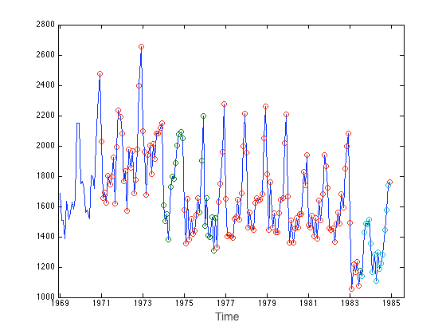

--- 
title       : Events in turbulence time series
subtitle    : Presubmission review seminar 
author      : Yanfei Kang 
job         : Supervised by Prof. Kate Smith-Miles and Dr. Danijel Belusic
framework   : io2012   # {io2012, html5slides, shower, dzslides, ...}
highlighter : highlight.js  # {highlight.js, prettify, highlight}
hitheme     : tomorrow      # 
widgets     : mathjax
mode        : selfcontained # {standalone, draft, selfcontained}
transition  : fade

--- 

## Motivation

- Event <u>detection</u>, <u>classification</u> and <u>interpretation</u> in  turbulence time series.

  - Location?
  - Similar?
  - Physical mechanisms?

--- 

## Difficulties

- Red noise
- Varibility of scales.
- Previously unknown.
- Small amount of literature.

--- 

## Objectives 

>1. Develop a method to detect and classify events:
  - does not require any pre-assumptions of events.
  - deal with high noise.
  - not limited by scales. 
>2. Application of the method on a well-known dataset
  - also a validation of the method.
>3. Use the method to
  - detect events in the generally unknown stable atmospheric turbulence.
  - find  physical  dynamics of different types of events.
  - study the effects of the event to the turbulence flows.  
>4. Develop a statistical tool and make it easy to use for others.

---

## The journey 

--- bg:#f5f5ae 

## Chapter 2

Kang Y (2012).
&ldquo;Real-time change detection in time series based on growing feature quantization.&rdquo;
In <EM>Proceedings of the 2012 International Joint Conference on Neural Networks (IJCNN)</EM>, pp. 1&ndash;6.
IEEE.

- growing clustering of subsequences
- features
- changes

--- &twocol
## Examples

*** =left

*** =right

--- bg:#f5f5ae
##  Chapter 3 

Kang Y, Belusic D and Smith-Miles K (2014).
&ldquo;A note on the relationship between turbulent coherent structures and phase correlation (Resubmitted after revision).&rdquo;
<EM>Chaos: An Interdisciplinary Journal of Nonlinear Science</EM>.

## What are events? Characteristics?

### Coherent structures

- A typical type of events

- Generally used assumption: phase correlation

- Really? Can we use that to detect events?

---
## Coherent structures = phase correlated ?

- Coherent structures detected using wavelets method
- Measure their phase correlation.
- How? By comparison with their surrogates.

### Surrogates of $x_O(t)$

1. phase randomized surrogate $x_R(t)$ (no phase correlation)
  - take the Fourier Transform of $x_O(t)$.
  - randomize phase information while keeping the magnitude.
  - do inverse Fourier Transform to get back to time domain to get $x_R(t)$.

2. completely coherent surrogate $x_C(t)$ (largest phase correlation)
  - obtained by making the phases constant.

---
## Measure of phase correlation I
### Coherence index ($CI$)

Given $x_O(t)$, $x_R(t)$ and $x_C(t)$,

$$CI(\tau)=\frac{|S_O(\tau)-S_R(\tau)|}{|S_O(\tau)-S_R(\tau))|+|S_O(\tau)-S_C(\tau)|},$$
where $S_i(\tau)$ is the 1st order structure function: $S_i(\tau)=\left<|x_i(t+\tau)-x_i(t)|\right>$, $i \in \{O, R, C\}$ and $\tau$ is the time lag.

>- $0 \leq CI \leq 1$
>- 1 = completely phase correlated 
>- 0 = random phase

---
## Measure of phase correlation II

### Nonlinearity Measure Based on Nonlinear Prediction Error ($nm_{npe}$)

Basis: Nonlinear time series with phase correlation:  more predictable than their surrogates.

\[
X=
  \begin{bmatrix}
    x(1) & x(2) & \cdots & x(m) \\
    x(2) & x(3) & \cdots & x(m+1) \\
    \cdots & \cdots & \cdots & \cdots \\
    x(n-m+1) & x(n-m+2) & \cdots & x(n) \\
  \end{bmatrix}
\] 

For each row, find its $k$ nearest  delay vectors, denoted as $\vec{x}_{j_p}$, $p=1, \cdots, k$, then
$$
\tau_X(m, k)= \sum\limits_{i=1}^{n-m}\left(x(i+m) - \frac{1}{k}\sum\limits_{p=1}^k x(j_p+m)\right)^2.
$$

---
## Measure of phase correlation II

### Nonlinearity Measure Based on Nonlinear Prediction Error ($nm_{npe}$)

$$
nm_{npe}=\frac{\bar{\tau}_R-\tau_X}{3\sigma_{R}},
$$
where $\tau_X$ is the $npe$ of the original, while $\bar{\tau}_R$ and $\sigma_R$ are the mean and standard deviation of the $npe$ of the surrogates. 

$$
\begin{aligned}
& \\
&x(t) \text{ is } \begin{cases}
  \text{phase-correlated,} & \text{if } nm_{npe} \geq 1, \\
  \text{phase-uncorrelated,} & \text{otherwise}.
\end{cases}
\end{aligned}
$$

---
## Results 
- 1999 Cooperative Atmosphere–Surface Exchange Study (CASES-99) (<a href="">Poulos et al. (2002)</a>).
- 1-s averages of data for one day (252 events)

---
## Conclusion 3

>- coherent structures ?= phase correlation..

>- the space and time organized structures in turbulent flow do not necessarily have correlated phases.

>- quantitative way of event description difficult.

>- then?

--- bg:#f5f5ae

## Chapter 4

Kang Y, Smith-Miles K and Belusic D (2013).
&ldquo;How to extract meaningful shapes from noisy time-series subsequences?&rdquo;
In <EM>Proceedings of the 2013 IEEE Symposium on Computational Intelligence and Data Mining (CIDM)</EM>, pp. 65-72.
IEEE.

## Focus shifted

---
## Artificial time series

  

---

## Methodology: two steps

1. Detect events.

2. Cluster the detected events.

---

## $1$st step: event detection 

- Perform  noise test on each subsequence.
- Why? Only care the non-noise subsequences.
  - white noise test: Ljung-Box test
  - red noise test: fit $AR(1)$ model and perform white noise test on the model residuals
  - $H_0:$ noise

--- 

## $p$-value series for the artificial data

Then given a window length,  for the $q$th subsequence, get $p$-value $p_q$. For $x(t)$,  a $p$-value series:  $p_1,p_2,\cdots,p_{m-w+1}$.

---
## How to define events?

- *A potential event* is a subsequence whose noise test $p$ value is smaller than a predefined significant level $\alpha$ ($\alpha=0.05$).

- Assume there exists a consecutive sequence of $p$ values $p_s,p_{s+1},\cdots,p_t$ which satisfies: 

  - $p_i\leq \alpha, i=s, s+1, \cdots, t$
  - $t-s\geq w/2$ 

    then we define the subsequence $x_{\left\lfloor\frac{t+s}{2}\right\rfloor}(t)$ as *the event* for which we are searching.

--- 

## Showing how it works

---

## Events extracted

---

## Robust to noise?

--- &twocol w1:50% w2:50%

## 2nd step: event classification
#### Goal: cluster the extracted events into patterns (http://robjhyndman.com/hyndsight/tscharacteristics/).
*** =left

*** =right 

---
## 2nd step: event classification (GFQ)

--- 
## Conclusion 4

- Two-step
  - detection
  - classification  
- Applied to artificial and real world data
- Better results than literature
- Robust to noise level
- A big step regarding Objective 1

--- bg:#f5f5ae

## Chapter 5

Kang Y, Belusic D and Smith-Miles K (2014).
&ldquo;Detecting and Classifying Events in Noisy Time Series.&rdquo;
<EM>Journal of the Atmospheric Sciences</EM>, <B>71</B>(3), pp. 1090&ndash;1104.

## What's done?

- Method improvement
- Application to a well known dataset
- Validation of the method

---
## Motivation

- Practical problems: 
  - non-stationarity
- AR(1) modelling --- stationarity
- Phillips-Perron (PP) Unit Root Test (<a href="">Perron (1988)</a>)
  - No trend, no drift: $X_t=\phi*X_{t-1}+u_t \: (H_0: \phi=1)$
  - No trend, drift: $X_t=\delta+\phi*X_{t-1}+u_t \: (H_0: \phi=1)$
  - Trend, drift: $X_t=\delta+a+b*t+\phi*X_{t-1}+u_t \: (H_0: \phi=1)$

---

## PP Unit Root Test 

$$X_t = \beta*D_t + \phi*X_{t-1}+u_t,$$

$$ H_0: \phi = 1 \text{ (unit root)}$$ 
$$ H_1: \phi < 1 \text{ (stationary)}$$

- Drift and deterministic trend are considered in $D_t$.

---

## Example: PP test 

---
## Problem

 Difficult to statistically distinguish between random walk processes from a stationary process contaminated by a structrual break, for example:

 $$
\begin{aligned}
& X_t = 0.5*X_{t-1} + 20*DU_t + u_t, \\
&DU_t = \begin{cases}
  1, & \text{if } t > 500, \\
  0, & \text{otherwise}.
\end{cases}
\end{aligned}
$$

---

## Structure breaks

In the presence of a structural break, the tests are biased towards the non-rejection of the null hypothesis.

---

## ZA test

A unit root test which considers structure break: Zivot \& Andrews (ZA) unit root test (<a href="">Zivot & Andrews (1992)</a>)

Allow a break in the null and alternative:

$$
\begin{aligned}
&\triangle X_t=\pi*X_{t-1}+\theta*DU_t+\sum\limits_{j=1}^p \triangle X_{t-j}+u_t, \\
&DU_t = \begin{cases}
  1, & \text{if } t > TB, \\
  0, & \text{otherwise}.
\end{cases}
\end{aligned}
$$

---  &twocol w1:50% w2:50%

## ZA test example

*** =left

*** =right

 
 

Percentage of unit-root processes using PP: 100%

Percentage of unit-root processes using ZA: 0%

 
 
 
 
 
Percentage of unit-root processes using PP: 97.8%

Percentage of unit-root processes using ZA: 1%

---

## The improved method

---

## Comparison with literature
### This is a comparison with wavelets method (<a href="">Thomas & Foken (2005)</a>).

---

## Using the method
### Testing the performance

- 1999 Cooperative Atmosphere–Surface Exchange Study (CASES-99) (<a href="">Poulos et al. (2002)</a>).

- 1-s averages of data from 1100 LST 5 October to 1100 LST 6 October ($l=86400$).

- validation by comparing the results with the previous studies.

 

--- &twocol w1:40% w2:60%

## Event detection and clustering 

*** =left
### 102 events clustered using:
  - `sd`
  - `Kurtosis`
  - `Skewness`
  - `non-smoothness`: $\frac{\text{sd}(\text{diff}(x))}{\text{mean(diff}(x)}$
  - `diff kurtosis`:  kurtosis of diff($x$)
  - `diff Max`: $\text{max}(\text{diff}(x,\text{lag}=5))$
  - `diff Min`: $\text{min}(\text{diff}(x,\text{lag}=5))$
  - `Peroid`
  

*** =right
### Clustering

--- &twocol w1:50% w2:50%

## Physical behaviors

*** =left
 

 

- Evolution of clusters  in line with that of stability.

- Distinction between deep and shallow events. 
 

- Events found in line with literature. 
 
*** =right

---
## Conclusion 5

- Method improvemnet
- Comparison with wavelets
- Application to well-known data
- Validation of the method

 

--- bg:#f5f5ae
## Chapter 6

Kang Y, Belusic D and Smith-Miles K (2014).
&ldquo;Classes of Structures in the Stable Atmospheric Boundary Layer (Submitting soon).&rdquo;
<EM>Quarterly Journal of the Royal Meteorological Society</EM>.

## Application

- Motivation dataset --- FLOSS (<a href="">Mahrt (2011)</a>)

  - 130 nights; 9h per night
  - 6s averaged
  - $l=702000$

- Very stable unknown ABL. 

- No published results.

- Few studies on detailed physical analysis.

--- &twocol w1:50% w2:50%
## FLOSS events and clustering

*** =left

### 926 events grouped into 3 clusters

*** =right

--- &twocol w1:50% w2:50%
## FLOSS events: physical characteristics
*** =left

*** =right

--- &twocol w1:60% w2:40%
## FLOSS events: deep (shallow) events

*** =left
 

*** =right
 

--- &twocol w1:50% w2:50%
## FLOSS events: an example and its hodograph

*** =left

*** =right
 
 
 

--- bg:#f5f5ae
## Chapter 7

Kang Y, Belusic D and Smith-Miles K (2014).
&ldquo;Detecting Events from Very Noisy Time Series with the R package TED  (In preparation).&rdquo;
<EM>Journal of Statistical Software</EM>.

- R package to share our work with the community

- https://github.com/ykang/TED

--- bg:#f5f5ae
## Conclusion
### Event <u>detection</u>, <u>classification</u> and <u>interpretation</u> in turbulence.

---
## References

Kang Y (2012).
&ldquo;Real-time change detection in time series based on growing feature quantization.&rdquo;
In <EM>Proceedings of the 2012 International Joint Conference on Neural Networks (IJCNN)</EM>, pp. 1&ndash;6.
IEEE.

Kang Y, Smith-Miles K and Belusic D (2013).
&ldquo;How to extract meaningful shapes from noisy time-series subsequences?&rdquo;
In <EM>Proceedings of the 2013 IEEE Symposium on Computational Intelligence and Data Mining (CIDM)</EM>, pp. 65-72.
IEEE.

Kang Y, Belusic D and Smith-Miles K (2014).
&ldquo;A note on the relationship between turbulent coherent structures and phase correlation (Resubmitted after revision).&rdquo;
<EM>Chaos: An Interdisciplinary Journal of Nonlinear Science</EM>.

Kang Y, Belusic D and Smith-Miles K (2014).
&ldquo;Detecting and Classifying Events in Noisy Time Series.&rdquo;
<EM>Journal of the Atmospheric Sciences</EM>, <B>71</B>(3), pp. 1090&ndash;1104.

Kang Y, Belusic D and Smith-Miles K (2014).
&ldquo;Classes of Structures in the Stable Atmospheric Boundary Layer (Submitting soon).&rdquo;
<EM>Quarterly Journal of the Royal Meteorological Society</EM>.

---
## References

Kang Y, Belusic D and Smith-Miles K (2014).
&ldquo;Detecting Events from Very Noisy Time Series with the R package TED  (In preparation).&rdquo;
<EM>Journal of Statistical Software</EM>.

Mahrt L (2011).
&ldquo;Surface Wind Direction Variability.&rdquo;
<EM>Journal of Applied Meteorology and Climatology</EM>, <B>50</B>(1), pp. 144&ndash;152.

Poulos GS, Blumen W, Fritts DC, Lundquist JK, Sun J, Burns SP, Nappo C, Banta R, Newsom R, Cuxart J, Terradellas E, Balsley B and Jensen M (2002).
&ldquo;CASES-99: A Comprehensive Investigation of the Stable Nocturnal Boundary Layer.&rdquo;
<EM>Bulletin of the American Meteorological Society</EM>, <B>83</B>(4), pp. 555&ndash;581.

Perron P (1988).
&ldquo;Trends and random walks in macroeconomic time series: Further evidence from a new approach.&rdquo;
<EM>Journal of economic dynamics and control</EM>, <B>12</B>(2), pp. 297&ndash;332.

Zivot E and Andrews DWK (1992).
&ldquo;Further evidence on the great crash, the oil-price shock, and the unit-root hypothesis.&rdquo;
<EM>Journal of Business \&amp; Economic Statistics</EM>, <B>20</B>(1), pp. 25&ndash;44.

Thomas C and Foken T (2005).
&ldquo;Detection of Long-term Coherent Exchange over Spruce Forest Using Wavelet Analysis.&rdquo;
<EM>Theoretical and Applied Climatology</EM>, <B>80</B>, pp. 91-104.

---

## Questions?
 

